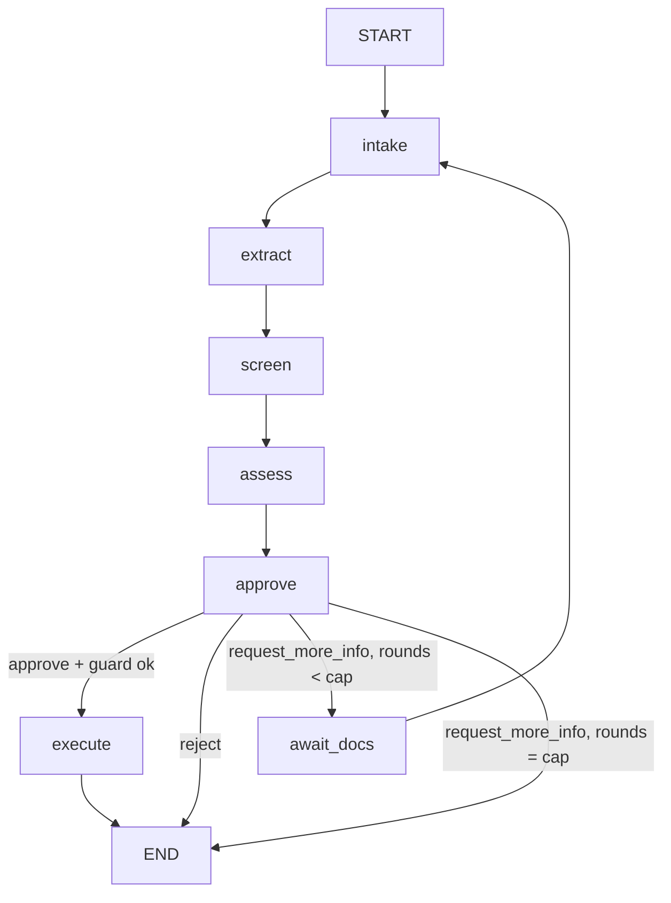

# Plan

Five phases. Each has a "done when" check that someone else could run. Decisions marked D-nn are in `DECISIONS.md` and
are proposals until the user approves them.

## Scope in one paragraph
Nine-step workflow: intake, extract (P3 KYC over HTTP), screen (vendored UN snapshot), assess (Python rules), approve
(LangGraph interrupt), execute (mock core-banking, idempotent), audit (hash-chained Postgres), evals, deploy (P3's EKS and
pipeline pattern). The LLM only summarises, explains, drafts and optionally annotates. See `CLAUDE.md` for hard rules.

## Graph

`await_docs` is a second interrupt (documents arrive as hashes; bytes go through the in-process buffer, never the
checkpoint). Approval guard (deterministic): an officer cannot approve while a screening hit has no disposition or while
extraction was unavailable; they can reject or request more info.

## Phase 0: README and architecture diagrams
Deliverable: `README.md` with intro, nine steps, application, tech stack, mermaid diagrams (workflow, request flow and workloads,
secrets, observability, audit chain, pipeline), environments, controls, evaluation status, layout, local development,
prerequisites, known gaps, roadmap.
**Done when:** the user has reviewed it, every mermaid block renders on GitHub, and it contains no metric or claim that is not
marked planned.

## Phase 1: plan and scaffolding
Deliverables: repo `client-onboarding-ai-agent` (name given by user, D-01); `CLAUDE.md`; `docs/` (this set + empty
`MODEL_INVENTORY.md` skeleton and `adr/`); `scripts/load_sanctions.py` + dated UN snapshot in `data/sanctions/` with
manifest (source URL, date, sha256, entry count); `data/reference/` jurisdiction and occupation lists with sources and
dates; the 12 synthetic case fixtures (`evals/cases/*.yaml`, each `SPECIMEN`) incl. recorded KYC responses; mock core-banking
service (idempotent create-customer, UNIQUE idempotency key) with tests; `docker-compose.yml`; `pyproject.toml`, ruff, mypy,
pytest skeleton; CI lint+test only.
**Status: built 2026-10-06; checks below were run and passed (see the end of this phase's section).**
**Done when:** `docker compose up` starts postgres + mock-bank + fake-kyc; `pytest` passes the mock-bank idempotency tests
(same key twice returns the same `customer_id`; same key with a different payload returns 409);
`load_sanctions.py` rebuilds the index and a unit test finds a known entry by exact name; every fixture file contains
`SPECIMEN`; `gitleaks` is clean; user has approved `DECISIONS.md`.

**Phase 1 results (2026-10-06):** compose starts postgres, mock-bank and fake-kyc, all healthy; replaying a `POST /customers`
with the same key returned 200, `Idempotent-Replayed: true` and the same `customer_id`; 34 tests pass (including a 16-thread
same-key race on real Postgres, which is skipped unless `MOCK_BANK_TEST_DATABASE_URL` is set); ruff, ruff format and mypy are clean; Gitleaks found
no leaks in the working tree or the four commits at that time; the sanctions index rebuilds deterministically (736 UN individuals, snapshot
date 2026-10-03) and is verified against its manifest hash. Not done: CI has not run on GitHub yet (workflow written, never pushed),
and the Docker image was built locally only.

## Phase 2: graph to assess, rules, audit chain
**Status: built 2026-10-06 on `feature/onb-002-graph-rules-audit`; results at the end of this section.**
Deliverables: `CaseState`; nodes `intake`, `extract` (KYC tool with timeout, retry, and degrade path), `screen` (normalise,
rapidfuzz scorer, corroboration, reason records), `assess` (rule engine, one module per rule family, rating aggregation);
LLM wrapper with fake implementation, retry/backoff, prompt name+version capture; audit log (table, trigger, role grants, hash
chain, `verify` CLI); CLI runner `graph.build` with in-memory checkpointer.
**Done when:**
- all 12 fixtures run end to end to the approval point through the CLI with a fake LLM and fake KYC, trajectories as expected;
- unit tests: each node, each rule (fires / does not fire / boundary), scorer (exact, transposed, transliterated variant,
  DOB mismatch demotion), KYC-down and LLM-down degrade paths;
- audit tests: `UPDATE` and `DELETE` and `TRUNCATE` raise; tampering a row (superuser edit in the test) makes `verify` fail at
  the right row; concurrent appends keep one linear chain;
- a test proves no route function reads LLM output.

**Phase 2 results (2026-10-06):** all 12 fixtures run offline to the approval pause with the trajectory `intake, extract, screen, assess, approve`
and match their expected recommendation, rating, hits (entry and class), fired rules and degraded flags (`python -m onboarding.graph.build --all`:
12/12, audit chains verified 12/12). 210 tests pass without a database; with the compose Postgres, 219 pass, including the audit trigger and
role tests, tamper detection, a concurrent-append test (8 writers, 80 rows, one linear chain) and the verify CLI exit codes. Mutation checks:
reading `state.summary` in a route fails `test_routes_ignore_llm`; disabling the hash comparison fails the tamper tests. Built in this phase:
`CaseState` models; scorer, rules and rating (D-19); recommendation precedence (D-14); Postgres audit log with trigger, INSERT/SELECT-only role,
advisory-lock chain and verify CLI; LLM client interface, fake and Bedrock implementations (backoff, no retry multiplication), prompt store,
four roles with grounding checks and a circuit breaker; KYC HTTP tool with retry and degrade; document buffer; five nodes and the graph.
Not done in this phase: Bedrock has not been called for real (quota; stub-tested only); Langfuse prompts and tracing (Phase 3); the
Postgres checkpointer (the graph ran on LangGraph's in-memory one); resume, execute and the API (Phase 3); CI has not run these tests on
GitHub yet.

## Phase 3: approval, resume, execute, UI, Langfuse
**Status: built 2026-10-06 on `feature/onb-003-approval-execute-api-ui`; results at the end of this section.**
Deliverables: `approve` interrupt; Postgres checkpointer (`thread_id = case_id`, separate schema, strict msgpack); resume API
with interrupt-bound decisions and compare-and-set; startup recovery (scan non-terminal cases, re-invoke); `execute` with
idempotency and audit-before/after; checkpoint retention purge for terminal cases (D-13); mock bank uses its own database and role on the same Postgres instance; officer identity and separation of duties (D-08); minimal server-rendered officer UI
(case queue, case page with facts, hits with reasons, fired rules, recommendation, approve/reject/more-info, strict CSP, no
inline script, text-only rendering like P3's `/ui`); Langfuse: trace per case, span per node, tool and generation spans,
prompts fetched by label with cache and local fallback. (The eval harness moved to Phase 3b, D-15.)
**Done when:**
- kill-and-resume test: start a case, stop the process at the interrupt, start a new process, resume, case reaches
  `executing`/`approved` without re-running earlier nodes (asserted via audit rows and call counters);
- duplicate and stale resume are rejected and audited; replaying `execute` creates exactly one customer;
- UI e2e (httpx + HTML assertions) passes; CSP header test passes; no `innerHTML` and similar in static JS (P3's test pattern);
- a Langfuse trace for one case shows node spans, a generation with prompt name+version, and the same version appears in the
  corresponding audit row;

**Phase 3 results (2026-10-06):**
- **Workflow:** all 12 fixtures run end to end through the real `CaseService` with the scripted officer: first pause, decision, the document
  loop (`missing_poa`), execution at the mock bank, and the audit trail; 12/12 match their expected recommendation, rating, hits, rules,
  degraded flags, full trajectory and final status; audit chains verified 12/12 (`python -m onboarding.graph.build --all`).
- **Kill and resume (Postgres):** a case paused in one process is resumed and approved by a second, fresh process (new connections, empty buffer);
  each node ran once across both, the KYC service was not called again, the audit chain verifies. Also tested: a crash after the claim is finished by
  the next process, a document round across a restart, 8 concurrent decisions apply exactly once, a case held by one process is refused to another.
- **Safety:** stale, duplicate, wrong-pause, concurrent, self-submitted, guard-violating and audit-failing decisions are refused and audited with nothing
  applied; no edge reaches `execute` except from `approve`; `execute` refuses without an officer's approval; replaying the bank call returns the same
  customer. Submitters see status only. Retention purge works under the application role and leaves the audit log untouched.
- **UI:** server-rendered, no JavaScript, strict CSP, CSRF on every form, signed HttpOnly SameSite=Strict session, escaping tested with a hostile name.
  Driven by hand in a real browser against the compose stack: queue, case page, guard banner, a clear-and-approve decision that created a customer.
- **Langfuse:** with the real SDK and an in-memory exporter: one trace per case (id derived from the case id), node, tool and generation spans nested
  correctly, prompt name and version on each generation, no personal data in spans, tracing failures never break a case. Prompt fetch by label with
  fallback is tested with stubs.
- **Counts:** 367 tests: 350 pass and 17 skip without a database; all 367 pass against the compose Postgres. ruff, ruff format, mypy and Gitleaks (on the files the repo tracks) are clean.
- **Not done:** Langfuse Cloud and Bedrock were not called (no keys, zero quota); `scripts/sync_prompts.py` has not run against Langfuse; CI has not run
  these tests on GitHub; the UI was checked in one browser only; no screenshots committed yet (Phase 5); Prometheus metrics endpoint is not added.

## Phase 3b: evals (deferred until P3's KYC service is live, D-15)
Starts only when `POST /documents` on P3's KYC service succeeds in the cluster (Bedrock quota raised). Deliverables:
specimen-document generator carrying our synthetic names, the 12 cases in `docs/EVALS.md` run end to end against live KYC,
harness, metrics, LLM-judge, Langfuse dataset and run, first committed `evals/results/<date>.json`, CI eval gate.
**Done when:** `evals.run --live` writes a result file with `mode: live` and live KYC recorded; the deterministic part of the gate
exits 0 in CI; Langfuse run name and trace ids in the file resolve. Until then, the README makes no eval claims.

## Phase 4: images, manifests, pipeline, cluster
**Status: written and validated locally on `feature/onb-004-deploy-eks`; NOT deployed (applying Terraform and running the pipelines need your AWS credentials, GitHub settings and secret values). Results and the manual steps are at the end of this section.**
Deliverables: one image, two Deployments (`onboarding-api`, `onboarding-mock-bank`) selected by `command:` (D-11); Postgres StatefulSet per env; `k8s/{qa,prod}` kustomize (SecretStore, ExternalSecret,
Ingress in the shared ALB group, probes, non-root, read-only root fs, resource requests sized to the namespace quota);
`infra/terraform` own stack (ECR repo, namespaces `onboarding-qa/prod` with quota, deploy roles trusting this repo, IRSA role
for Bedrock, secret shells, ESO roles, own ACM cert, Route 53 aliases for `qa-proj4-onboarding` / `proj4-onboarding`; reads P3 via data
sources only; own state; `terraform destroy` leaves P3 intact); workflows copied from P3 and adapted (names, image, hosts, PROD_HOST, vars), plus an
eval-gate job (deterministic); free CPU/memory on the nodes measured first.
**Done when:** a push to `qa` runs Gitleaks, Checkov, Trivy, lint, tests, Sonar, build, Trivy image, SBOM, ECR push, deploy and
`kubectl rollout status`; `/healthz` is green in `qa`; a smoke script submits a synthetic case in qa, and the case reaches
`awaiting_officer`; extraction state is reported honestly (`extraction_unavailable` while P3's Bedrock quota is zero); PR
`qa` to `main` waits at the `prod` environment approval, retags `sha` to `prod-sha` (same digest) and rolls out.

**Phase 4 results (2026-10-06), what was checked without a cluster:**
- **Terraform:** `platform/`, `envs/qa/`, `envs/prod/` pass `terraform fmt` and `terraform validate`. Nothing was planned or applied (no AWS access from here).
  Stack layout, apply order, the secret values to set and the GitHub settings are in `infra/terraform/README.md`.
- **Manifests:** `kubectl kustomize k8s/qa` and `k8s/prod` render 16 resources each; kubeconform finds 12 valid, 0 invalid, and skips the 4 External Secrets
  objects (no schema). `tests/test_manifests.py` (26 checks) asserts: namespace, non-root, read-only root filesystem, dropped capabilities, resource
  limits, no `latest`, India-only model profile, fail-closed secrets, per-environment secret paths and storage, the shared-ALB Ingress, and the network policies.
- **The Postgres pod, locally:** the StatefulSet's security settings (user 999, read-only root, no capabilities, `no-new-privileges`) were reproduced with
  `docker run`; the init script created the roles and databases, `onboarding.db migrate` ran against it, and the mock-bank role connected.
  That run found two real bugs, both fixed and tested: the init script needs the executable bit, and concurrent `migrate` runs (several pods) deadlocked on an
  advisory lock (an open transaction and a blocked `pg_advisory_lock` both stall `CREATE INDEX CONCURRENTLY`); `migrate` now polls `pg_try_advisory_lock`
  on an autocommit connection, and a 4-way concurrent-migration test passes on Postgres.
- **Workflows:** `actionlint` is clean for both. They are copies of P3's with the differences listed in their headers. The scans were also run locally the
  way the pipeline runs them, in report-only mode: Checkov k8s 260 passed and 18 failed, Terraform 96 passed and 7 failed, Dockerfile 75 passed and 0 failed;
  Trivy on the built image: 44 HIGH and 0 CRITICAL, all Debian base-image packages (most with no fixed version), none in Python packages. See KNOWN_LIMITATIONS.
- **Image:** builds; runs the API, the mock bank and the migration from the one image; Gitleaks clean on tracked files.
- **Counts:** 394 tests: all pass against the compose Postgres (the 26 manifest tests need `kubectl`, present in CI runners).

**You need to do, in order** (nothing below has been done): (1) apply `infra/terraform/platform`, then `envs/qa`; (2) set the three secret values for qa;
(3) set the GitHub repository variable `AWS_ROLE_TO_ASSUME_QA` and, for prod, create the `prod` Environment with reviewers and set `AWS_ROLE_TO_ASSUME_PROD`;
(4) merge this branch into `qa`: the first QA run builds, scans, pushes, deploys and smoke-tests; (5) after the first deploy, `create_dns_record = true` and
re-apply the qa env stack; (6) repeat for prod and open the `qa` to `main` PR. The "Done when" checks above are met only after steps 1 to 4 succeed on the cluster.

**Phase 4 follow-ups from the first QA use:** the event loop was blocked by long requests (fixed, `feature/onb-006`); the UI has a busy state (`feature/onb-007`); officers can open the original documents (D-24, `feature/onb-008`: document store, officer-only audited access, S3 bucket and IAM in Terraform, `DOCUMENT_BUCKET` filled in by the pipeline).

## Phase 5: README, controls, demo
Deliverables: README (architecture, run it, numbers from `evals/results/` only, links to controls and decisions); CONTROLS
table filled with real evidence links and screenshots; `MODEL_INVENTORY.md` complete; Langfuse screenshots; 2-minute demo
clip script (below) and the recording.
**Done when (needs Phase 3b):** every number in README is traceable to a file in `evals/results/` (a small script greps README numbers and checks
them against the latest result); every CONTROLS evidence link resolves; the four resume claims are checked off below.

### 2-minute demo script
0:00 problem and the rule "LLM never decides" (one sentence). 0:15 submit the clean case: show trace-per-case in Langfuse
later. 0:30 submit the near-miss case: officer page shows the hit, score, algorithm, snapshot date, DOB mismatch reason, the
advisory LLM note labelled advisory. 0:55 officer must disposition the hit, then approves. 1:10 customer created in mock bank;
re-click execute: same customer id (idempotent). 1:25 kill the pod mid-case, resume. 1:40 `verify_audit_chain` passes, then
tamper a row in a scratch DB and show it fail. 1:50 Langfuse trace + eval results table. 2:00 end.

## Resume claims: how each becomes true
| Claim | True when |
|---|---|
| Agentic onboarding workflow: LangGraph, KYC tool, sanctions screening, risk rules, human approval, mock core-banking | Phase 3 done-when; e2e test on all fixtures |
| Controls mapped to CBUAE AI guidance | CONTROLS.md every row has evidence; clause numbers only if the official text was read |
| Prompt versioning and tracing in Langfuse; decision and trajectory evals with measured numbers | Phase 3 trace check + committed result file; README numbers script |
| Deployed on EKS via GitHub Actions with approval-gated promotion | Phase 4 done-when, with run URLs recorded in README |

## Cut list (apply in this order if behind)
1. Eval set 12 to 8 cases (keep: clean approve, true hit, near-miss, missing doc, low confidence, high-risk jurisdiction,
   KYC down, multiple issues).
2. Drop the LLM hit annotation (hard rule 4 of the LLM's duties).
3. Fuzzy matching to exact + normalised matching (hit reasons stay; near-miss case becomes "no hit"; update EVALS expectations).
4. UI to API + Swagger only.
5. Prod deploy to qa only (the claim "approval-gated promotion" then relies on the pipeline file, not a run: reword it).

## Risks
- Bedrock quota (affects LLM-live evals and P3's KYC in the cluster). Mitigation: template fallback, recorded KYC fixtures.
- Capacity on P3's 2-node cluster, and our stack's dependency on P3's cluster existing (D-10). Mitigation: measure before Phase 4.
- Pipeline copy drifts from P3 (D-04). Mitigation: a header comment records the P3 commit copied.
- CBUAE text not machine-readable from here (403): see CONTROLS.md.
