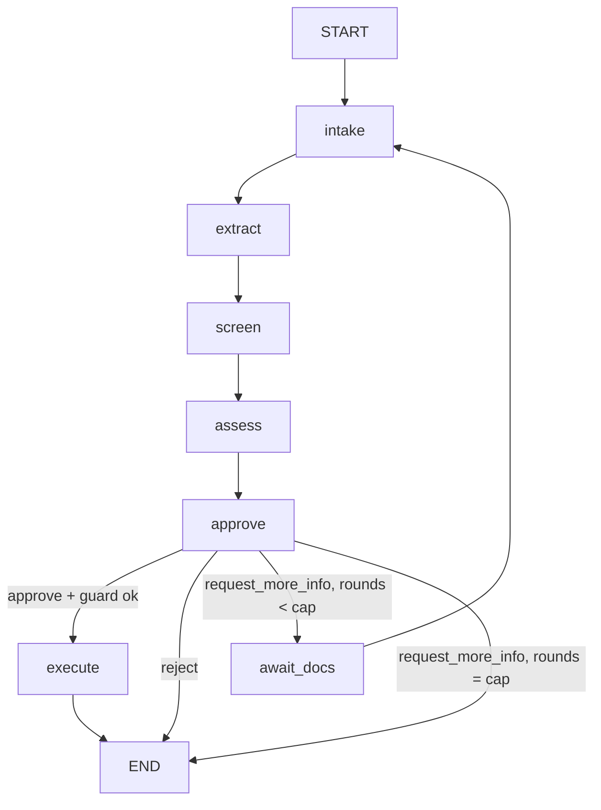

# Plan

Five phases. Each has a "done when" check that someone else could run. Decisions marked D-nn are in `DECISIONS.md` and
are proposals until the user approves them.

## Scope in one paragraph
Nine-step workflow: intake, extract (P3 KYC over HTTP), screen (vendored UN snapshot), assess (Python rules), approve
(LangGraph interrupt), execute (mock core-banking, idempotent), audit (hash-chained Postgres), evals, deploy (P3's EKS and
pipeline pattern). The LLM only summarises, explains, drafts and optionally annotates. See `CLAUDE.md` for hard rules.

## Graph

`await_docs` is a second interrupt (documents arrive as hashes; bytes go through the in-process buffer, never the
checkpoint). Approval guard (deterministic): an officer cannot approve while a screening hit has no disposition or while
extraction was unavailable; they can reject or request more info.

## Phase 0: README and architecture diagrams
Deliverable: `README.md` with intro, nine steps, application, tech stack, mermaid diagrams (workflow, request flow and workloads,
secrets, observability, audit chain, pipeline), environments, controls, evaluation status, layout, local development,
prerequisites, known gaps, roadmap.
**Done when:** the user has reviewed it, every mermaid block renders on GitHub, and it contains no metric or claim that is not
marked planned.

## Phase 1: plan and scaffolding
Deliverables: repo `client-onboarding-ai-agent` (name given by user, D-01); `CLAUDE.md`; `docs/` (this set + empty
`MODEL_INVENTORY.md` skeleton and `adr/`); `scripts/load_sanctions.py` + dated UN snapshot in `data/sanctions/` with
manifest (source URL, date, sha256, entry count); `data/reference/` jurisdiction and occupation lists with sources and
dates; the 12 synthetic case fixtures (`evals/cases/*.yaml`, each `SPECIMEN`) incl. recorded KYC responses; mock core-banking
service (idempotent create-customer, UNIQUE idempotency key) with tests; `docker-compose.yml`; `pyproject.toml`, ruff, mypy,
pytest skeleton; CI lint+test only.
**Status: built 2026-10-06; checks below were run and passed (see the end of this phase's section).**
**Done when:** `docker compose up` starts postgres + mock-bank + fake-kyc; `pytest` passes the mock-bank idempotency tests
(same key twice returns the same `customer_id`; same key with a different payload returns 409);
`load_sanctions.py` rebuilds the index and a unit test finds a known entry by exact name; every fixture file contains
`SPECIMEN`; `gitleaks` is clean; user has approved `DECISIONS.md`.

**Phase 1 results (2026-10-06):** compose starts postgres, mock-bank and fake-kyc, all healthy; replaying a `POST /customers`
with the same key returned 200, `Idempotent-Replayed: true` and the same `customer_id`; 34 tests pass (including a 16-thread
same-key race on real Postgres, which is skipped unless `MOCK_BANK_TEST_DATABASE_URL` is set); ruff, ruff format and mypy are clean; Gitleaks found
no leaks in the working tree or the four commits at that time; the sanctions index rebuilds deterministically (736 UN individuals, snapshot
date 2026-10-03) and is verified against its manifest hash. Not done: CI has not run on GitHub yet (workflow written, never pushed),
and the Docker image was built locally only.

## Phase 2: graph to assess, rules, audit chain
Deliverables: `CaseState`; nodes `intake`, `extract` (KYC tool with timeout, retry, and degrade path), `screen` (normalise,
rapidfuzz scorer, corroboration, reason records), `assess` (rule engine, one module per rule family, rating aggregation);
LLM wrapper with fake implementation, retry/backoff, prompt name+version capture; audit log (table, trigger, role grants, hash
chain, `verify` CLI); CLI runner `graph.build` with in-memory checkpointer.
**Done when:**
- all 12 fixtures run end to end to the approval point through the CLI with a fake LLM and fake KYC, trajectories as expected;
- unit tests: each node, each rule (fires / does not fire / boundary), scorer (exact, transposed, transliterated variant,
  DOB mismatch demotion), KYC-down and LLM-down degrade paths;
- audit tests: `UPDATE` and `DELETE` and `TRUNCATE` raise; tampering a row (superuser edit in the test) makes `verify` fail at
  the right row; concurrent appends keep one linear chain;
- a test proves no route function reads LLM output.

## Phase 3: approval, resume, execute, UI, Langfuse, evals
Deliverables: `approve` interrupt; Postgres checkpointer (`thread_id = case_id`, separate schema, strict msgpack); resume API
with interrupt-bound decisions and compare-and-set; startup recovery (scan non-terminal cases, re-invoke); `execute` with
idempotency and audit-before/after; checkpoint retention purge for terminal cases (D-13); mock bank uses its own database and role on the same Postgres instance; officer identity and separation of duties (D-08); minimal server-rendered officer UI
(case queue, case page with facts, hits with reasons, fired rules, recommendation, approve/reject/more-info, strict CSP, no
inline script, text-only rendering like P3's `/ui`); Langfuse: trace per case, span per node, tool and generation spans,
prompts fetched by label with cache and local fallback. (The eval harness moved to Phase 3b, D-15.)
**Done when:**
- kill-and-resume test: start a case, stop the process at the interrupt, start a new process, resume, case reaches
  `executing`/`approved` without re-running earlier nodes (asserted via audit rows and call counters);
- duplicate and stale resume are rejected and audited; replaying `execute` creates exactly one customer;
- UI e2e (httpx + HTML assertions) passes; CSP header test passes; no `innerHTML` and similar in static JS (P3's test pattern);
- a Langfuse trace for one case shows node spans, a generation with prompt name+version, and the same version appears in the
  corresponding audit row;

## Phase 3b: evals (deferred until P3's KYC service is live, D-15)
Starts only when `POST /documents` on P3's KYC service succeeds in the cluster (Bedrock quota raised). Deliverables:
specimen-document generator carrying our synthetic names, the 12 cases in `docs/EVALS.md` run end to end against live KYC,
harness, metrics, LLM-judge, Langfuse dataset and run, first committed `evals/results/<date>.json`, CI eval gate.
**Done when:** `evals.run --live` writes a result file with `mode: live` and live KYC recorded; the deterministic part of the gate
exits 0 in CI; Langfuse run name and trace ids in the file resolve. Until then, the README makes no eval claims.

## Phase 4: images, manifests, pipeline, cluster
Deliverables: one image, two Deployments (`onboarding-api`, `onboarding-mock-bank`) selected by `command:` (D-11); Postgres StatefulSet per env; `k8s/{qa,prod}` kustomize (SecretStore, ExternalSecret,
Ingress in the shared ALB group, probes, non-root, read-only root fs, resource requests sized to the namespace quota);
`infra/terraform` own stack (ECR repo, namespaces `onboarding-qa/prod` with quota, deploy roles trusting this repo, IRSA role
for Bedrock, secret shells, ESO roles, own ACM cert, Route 53 aliases for `qa-proj4-onboarding` / `proj4-onboarding`; reads P3 via data
sources only; own state; `terraform destroy` leaves P3 intact); workflows copied from P3 and adapted (names, image, hosts, PROD_HOST, vars), plus an
eval-gate job (deterministic); free CPU/memory on the nodes measured first.
**Done when:** a push to `qa` runs Gitleaks, Checkov, Trivy, lint, tests, Sonar, build, Trivy image, SBOM, ECR push, deploy and
`kubectl rollout status`; `/healthz` is green in `qa`; a smoke script submits a synthetic case in qa, and the case reaches
`awaiting_officer`; extraction state is reported honestly (`extraction_unavailable` while P3's Bedrock quota is zero); PR
`qa` to `main` waits at the `prod` environment approval, retags `sha` to `prod-sha` (same digest) and rolls out.

## Phase 5: README, controls, demo
Deliverables: README (architecture, run it, numbers from `evals/results/` only, links to controls and decisions); CONTROLS
table filled with real evidence links and screenshots; `MODEL_INVENTORY.md` complete; Langfuse screenshots; 2-minute demo
clip script (below) and the recording.
**Done when (needs Phase 3b):** every number in README is traceable to a file in `evals/results/` (a small script greps README numbers and checks
them against the latest result); every CONTROLS evidence link resolves; the four resume claims are checked off below.

### 2-minute demo script
0:00 problem and the rule "LLM never decides" (one sentence). 0:15 submit the clean case: show trace-per-case in Langfuse
later. 0:30 submit the near-miss case: officer page shows the hit, score, algorithm, snapshot date, DOB mismatch reason, the
advisory LLM note labelled advisory. 0:55 officer must disposition the hit, then approves. 1:10 customer created in mock bank;
re-click execute: same customer id (idempotent). 1:25 kill the pod mid-case, resume. 1:40 `verify_audit_chain` passes, then
tamper a row in a scratch DB and show it fail. 1:50 Langfuse trace + eval results table. 2:00 end.

## Resume claims: how each becomes true
| Claim | True when |
|---|---|
| Agentic onboarding workflow: LangGraph, KYC tool, sanctions screening, risk rules, human approval, mock core-banking | Phase 3 done-when; e2e test on all fixtures |
| Controls mapped to CBUAE AI guidance | CONTROLS.md every row has evidence; clause numbers only if the official text was read |
| Prompt versioning and tracing in Langfuse; decision and trajectory evals with measured numbers | Phase 3 trace check + committed result file; README numbers script |
| Deployed on EKS via GitHub Actions with approval-gated promotion | Phase 4 done-when, with run URLs recorded in README |

## Cut list (apply in this order if behind)
1. Eval set 12 to 8 cases (keep: clean approve, true hit, near-miss, missing doc, low confidence, high-risk jurisdiction,
   KYC down, multiple issues).
2. Drop the LLM hit annotation (hard rule 4 of the LLM's duties).
3. Fuzzy matching to exact + normalised matching (hit reasons stay; near-miss case becomes "no hit"; update EVALS expectations).
4. UI to API + Swagger only.
5. Prod deploy to qa only (the claim "approval-gated promotion" then relies on the pipeline file, not a run: reword it).

## Risks
- Bedrock quota (affects LLM-live evals and P3's KYC in the cluster). Mitigation: template fallback, recorded KYC fixtures.
- Capacity on P3's 2-node cluster, and our stack's dependency on P3's cluster existing (D-10). Mitigation: measure before Phase 4.
- Pipeline copy drifts from P3 (D-04). Mitigation: a header comment records the P3 commit copied.
- CBUAE text not machine-readable from here (403): see CONTROLS.md.
